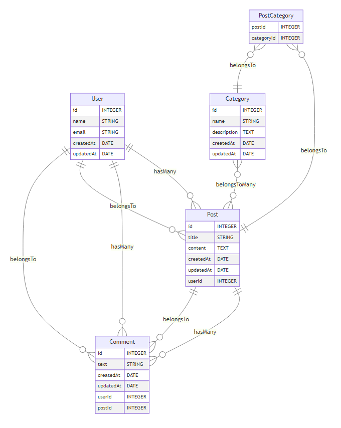

# ERD Generator

**ERD Generator** is a CLI tool that generates Entity-Relationship Diagrams (ERD) for Sequelize and Mongoose models.

## Features
- Supports Sequelize (MySQL, PostgreSQL) and Mongoose.
- Outputs diagrams in `svg`, `png`, or `markdown`.

## Screenshot



## Installation

```bash
npm install -g erd-generator
```

## Use

#### Generate ERD for Sequelize (MySQL)
```bash
erd-gen --type sequelize --dialect mysql --dbHost localhost --dbUser root --dbPassword secret --dbName mydb --outputDir ./erd --format svg
```
#### Generate ERD for Sequelize (PostgreSQL)
```bash
erd-gen --type sequelize --dialect postgres --dbHost localhost --dbUser root --dbPassword secret --dbName mydb --outputDir ./erd --format md
```
#### Generate ERD for Mongoose
```bash
erd-gen --type mongoose --dbHost localhost --dbName mydb --outputDir ./erd --format png
```

## Options
| **Option**       | **Description**                                     | **Required**                      |
|-------------------|-----------------------------------------------------|------------------------------------|
| `--type`         | Specifies the ORM type: `sequelize` or `mongoose`   | Yes                                |
| `--dialect`      | Specifies the database type: `mysql` or `postgres`  | Yes (if `--type=sequelize`)        |
| `--dbHost`       | Specifies the database host                         | Yes                                |
| `--dbUser`       | Specifies the database username                     | No 
| `--dbPassword`   | Specifies the database password                     | No
| `--dbName`       | Specifies the database name                         | Yes                                |
| `--outputDir`    | Specifies the output directory for generated files  | No (default: `./erd`)              |
| `--format`       | Specifies the output format: `svg`, `png`, or `md`  | No (default: `svg`)                |


## Contributing

Contributions are welcome! Feel free to submit issues or pull requests.

## License

This project is licensed under the [MIT License](LICENSE).

